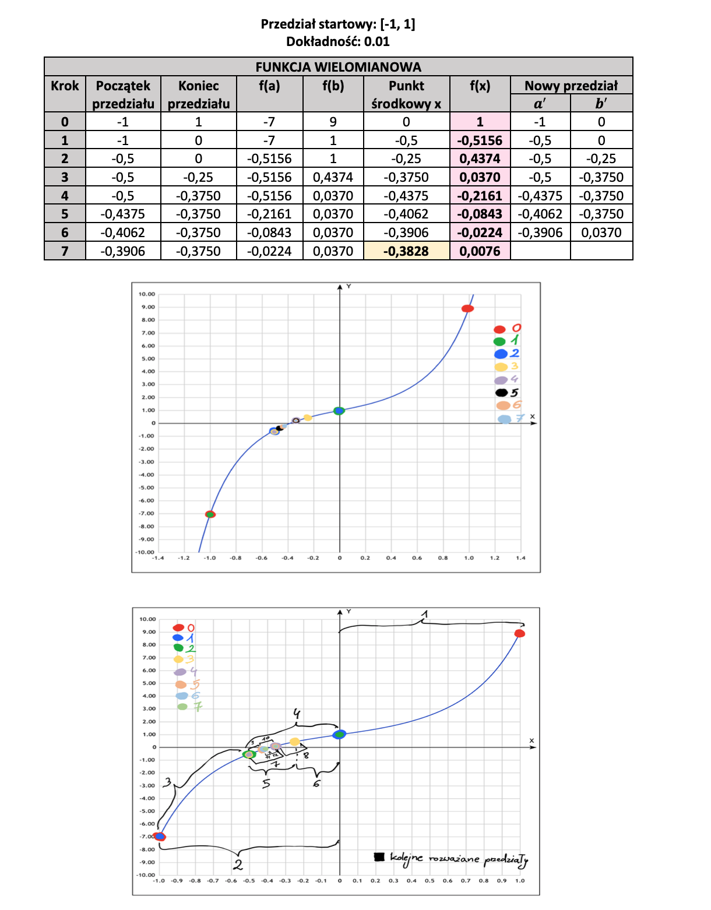
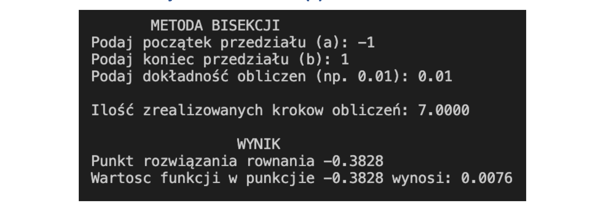

## Opis programu

Program rozwiązuje dowolne równanie nieliniowe stosując metodę bisekcji. Użytkownik podaje przedział, w którym będą wykonywane obliczenia oraz dokładność obliczeń. Program dzieli podany przez użytkownika przedział na mniejsze przedziały. Następnie sprawdza, czy iloczyn punktu początkowego i końcowego jest mniejszy od zera. Dla przedziału, który spełnia ten warunek przechodzi dalej do obliczeń. Następnie liczy średnią ze skrajnych punktów nowego przedziału i porównuje otrzymany wynik z zadaną przez użytkownika dokładnością. Warunkiem zakończenia działania programu jest osiągnięcie takiej średniej liczby ze skrajnych punktów przedziału, która będzie mniejsza od zadanej dokładności.

#### Uwaga

W programie funkcje nieliniowe można zmieniać. Wystarczy tylko w funkcji głównej zmienić nazwę funkcji na taką jaka została zadeklarowana przed funkcją główną (np. funkcja_wielomianowa, funkcja_trygonometryczna, funkcja_logarytmiczna). Każda nowo utworzona funkcja jest obsługiwana przez program.

## Działanie programu

Działanie programu zostało przedstawione za pomocą przykładowej funkcji wielomianowej.

**Funkcja wielomianowa f(x) = 2x^7 + 4x^3 + 2x + 1**

### Graficzne przedstawienie działania programu

## Wyniki obliczeń

