## Opis programu
Program za pomocą metody eliminacji Gaussa rozwiązuje dowolnej wielkości układ równań. Przykład działanie programu został przedstawiony poniżej. W analizowanym przykładzie mamy do czynienie z układem równań składającym się z czterech niewiadomych.

## Układ równań do rozwiązania

0,02 𝑥1 + 0,01 𝑥2 + 0,00 𝑥3 + 0,00 𝑥4 = 0,02 
1,00 𝑥1 + 2,00 𝑥2+ 1,00 𝑥3 + 0,00 𝑥4 = 1,00 
0,00 𝑥1 + 1,00 𝑥2+ 2,00 𝑥3 + 1,00 𝑥4 = 4,00 
0,00 𝑥1 + 0,00 𝑥2+ 100 𝑥3 + 200 𝑥4 = 800

## Zawartość pliku gauss.txt

| 4    | ilość wierszy macierz |        |       |          |
|------|--------|--------|--------|----|------|
| 0.02 | 0.01 | 0 | 0 | 0.02 | cztery współrzędne stojące przy niewiadomych oraz wynik równania|
| 1 | 2 | 1 | 0 | 1 | cztery współrzędne stojące przy niewiadomych oraz wynik równania|
| 0 | 1| 2 | 1 | 4 | cztery współrzędne stojące przy niewiadomych oraz wynik równania|
| 0 | 0 | 100 | 200 | 800 | cztery współrzędne stojące przy niewiadomych oraz wynik równania|

## Działanie programu

Po wprowadzeniu elementów macierzy do programu rozpoczyna się pivoting. Program sprawdza czy elementy na przekątnej nie są równe 0.
Tworzę zagnieżdżone pętle. Program zaczyna pivoting od pierwszego elementu pierwszego wiersza. W drugiej pętli najpierw porównuje pierwszy element drugiego wiersza z pierwszym elementem pierwszego wiersza. Jeśli element z pierwszego wiersza jest mniejszy od pierwszego elementu w drugim wierszu to wykonywana jest zamiana miejscami tych elementów i tak postępuje z kolejnymi elementami w wierszach (drugi element drugiego wiersza zamienia z drugim elementem pierwszego wiersza itd. do końca wiesza).

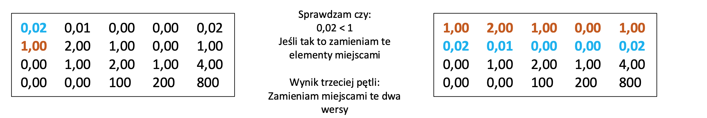

Dalej w drugiej pętli porównuje pierwszy element pierwszego wiersza z pierwszym elementem trzeciego wiersza. Jeśli w pierwszym wierszu element jest mniejszy to dokonuje identycznej zamiany jak powyżej, ale tym razem z trzecim wierszem (jeśli element nie jest mniejszy to nie dokonujemy zamiany). Tak postępujemy aż nie będzie więcej wierszy do porównywania.

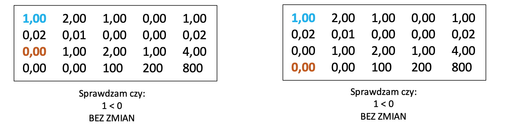

W kolejnej iteracji głównej pętli bierze drugi element na przekątnej (czyli drugi element drugiego wiersza). Porównuje ten element z drugim elementem trzeciego wierszu. Jeśli ten element jest mniejszy od drugiego elementu trzeciego wersu to dokonuje zamiany miejscami pomiędzy tymi wierszami w taki sam sposób jak powyżej (rozpoczyna zamianę od pierwszych elementów w wersie drugim i trzecim). Postępuję dokładnie tak samo porównując kolejne wersy z wersem drugim.

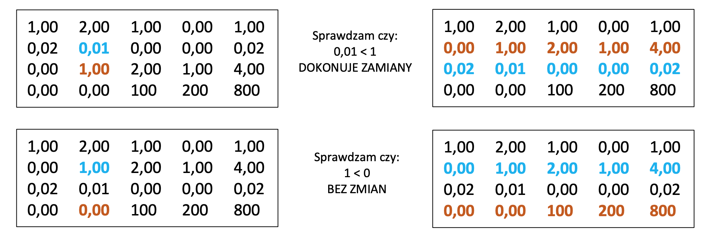

W kolejnych iteracjach sprawdza kolejne elementy na przekątnej i gdy istnieje taka powinność dokonuje zamiany. Wykonuje te operacje aż do momentu porównania wszystkich elementów na przekątnej.

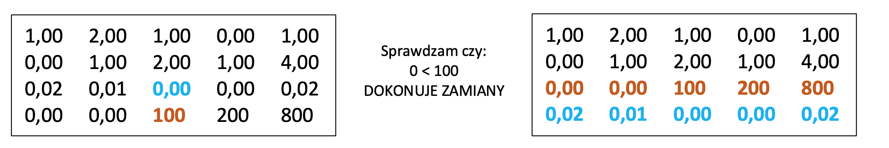
KONIEC PIVOTINGU

Następnie program wykonuje algorytm eliminacji Gaussa. Tworzę zagnieżdżone pętle. Następnie w drugiej pętli program dzieli pierwszy element drugiego wiersza przez pierwszy element na przekątnej (pierwszy element pierwszego wiersza).Otrzymany wynik przypisuje do zmiennej pomocniczej „iloraz”. Wraz z kolejnymi iteracjami pętli zmienia się wartość ilorazu (program dzieli pierwszy element kolejnego wersu przez pierwszy element na przekątnej). W kolejnym etapie program oblicza nową wartość dla pierwszego elementu drugiego wersu odejmując od obecnej wartości iloczyn zmiennej iloraz oraz pierwszy element pierwszego wersu. Podobne obliczenia wykonuje dla drugiego elementu drugiego wersu (od obecnej wartości drugiego elementu drugiego wersu odejmuje iloczyn zmiennej iloraz oraz drugiego elementu pierwszego wersu itd. do końca wersu).

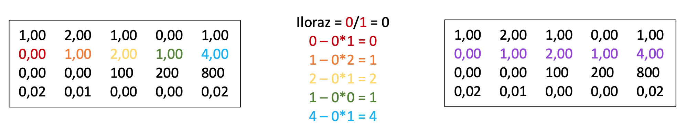

Po wykonaniu obliczeń dla drugiego wersu, program liczy w analogiczny sposób kolejne wartości wersów odejmując od ich obecnej wartości iloczyn nowej zmiennej iloraz oraz wartości pierwszego wersu.

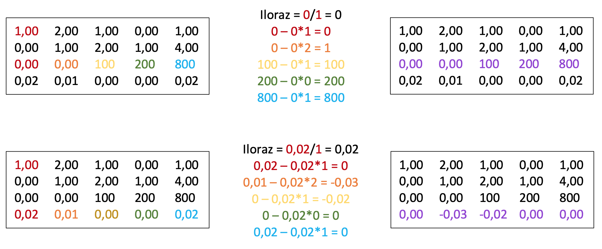

W kolejnej iteracji głównej pętli program dokonuje obliczeń nowych wartości wierszy rozpoczynając obliczenia dla trzeciego wersu. Liczy iloraz dzieląc drugi element trzeciego wersu przez drugą wartość na przekątnej (drugi element drugiego wersu). Nowe wartości wersu liczy odejmując od obecnej wartości iloczyn ilorazu i elementu z drugiego wersu.

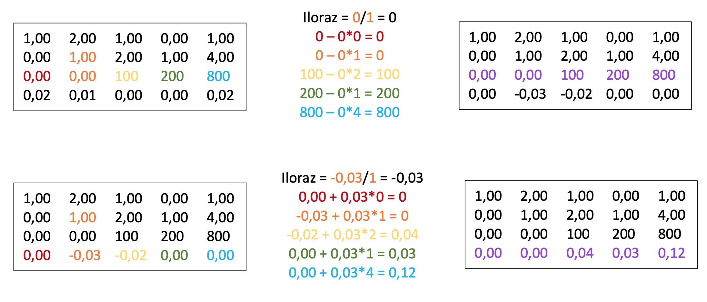

Następuje kolejna iteracja głównej pętli. Program wykonuje obliczenia analogicznie do powyższych

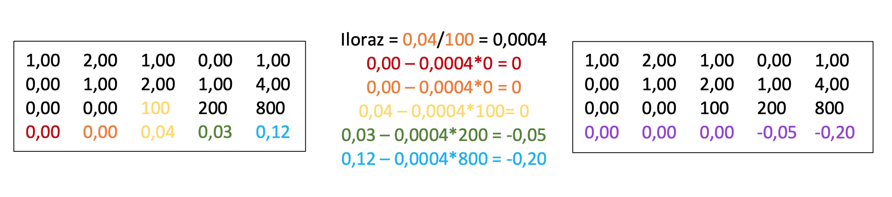

Na tym etapie powstaje gotowy układ równań do wyliczenia niewiadomych.

Na koniec program wylicza rozwiązania układu. Do zmiennej wynik[3] przypisuje piąty element z czwartego wersu. Następnie sprawdzane są warunki pętli. W pierwszej iteracji warunek się nie zgadza więc program wychodzi z pętli i wykonuje dzielenia. Dzieli wartość w zmiennej wynik przez czwarty element czwartego wiersza.

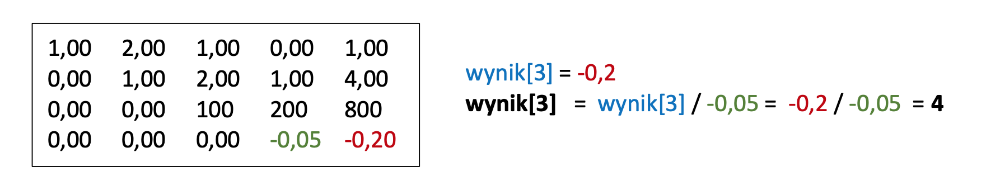

Następnie główna pętla wykonuję się jeszcze raz. Następuje przypisanie piątego elementu trzeciego wersu do zmiennej wynik[2]. I następnie program wykonuje obliczenia przedstawione poniżej.

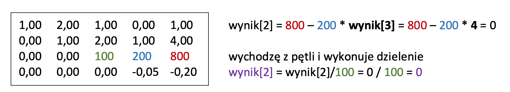

Kolejne obliczenia przeprowadzono analogicznie do powyższych.

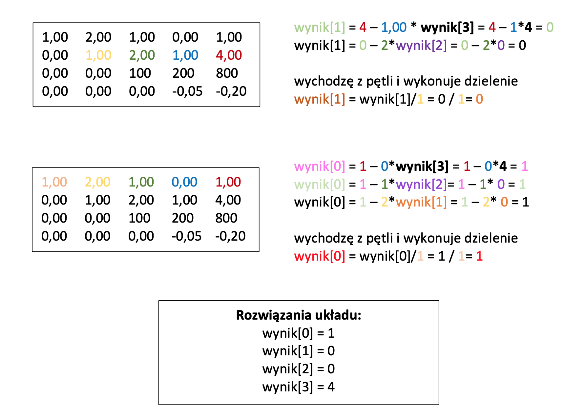

Na samym końcu program wypisuje obliczone wartości i kończy swoje działanie.

## Wyniki działania programu

