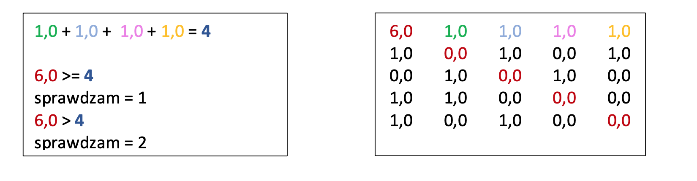
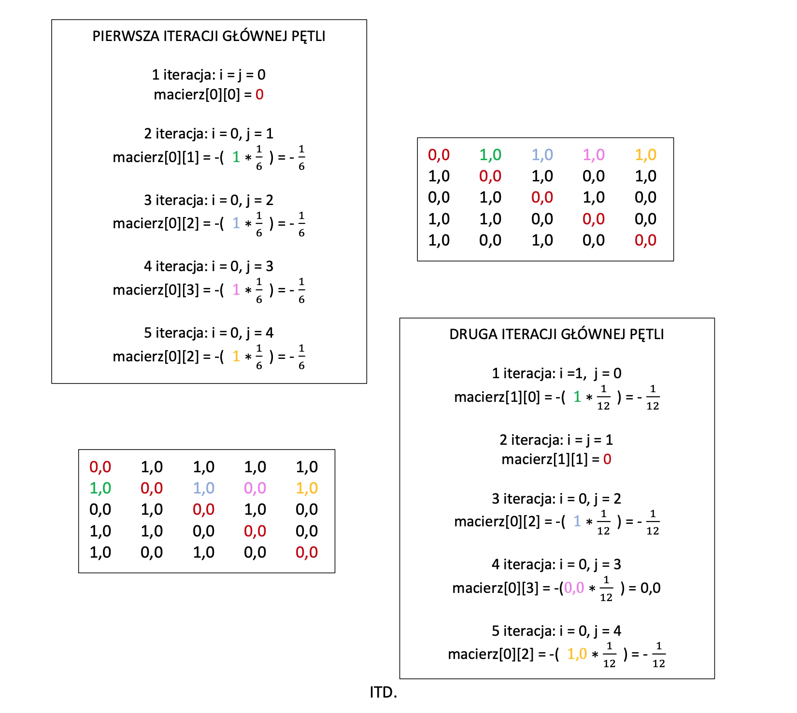
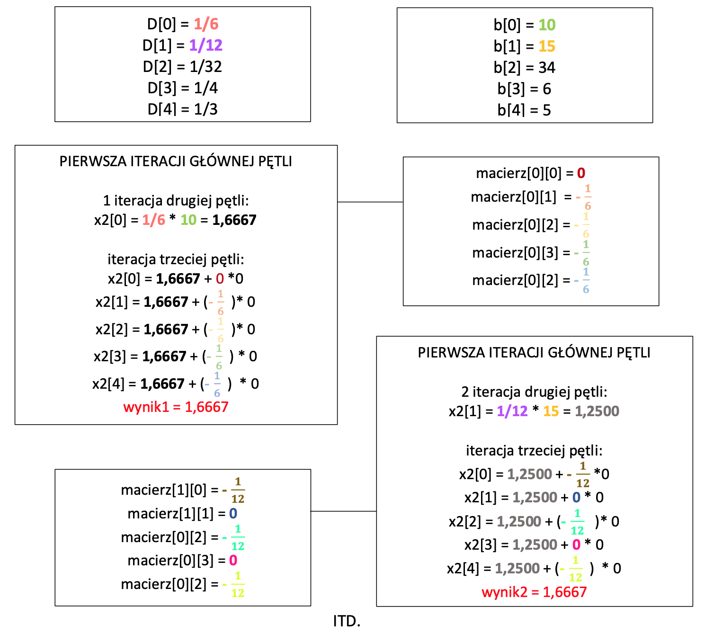
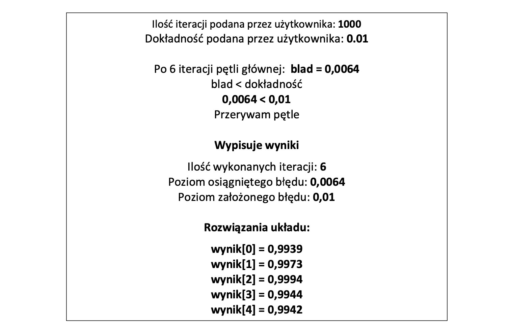
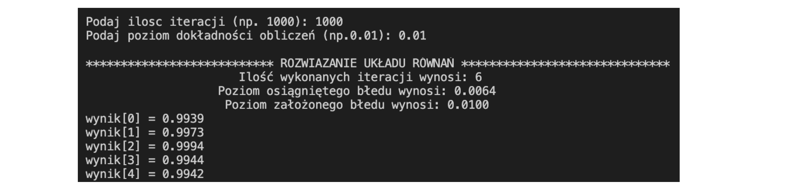

## Opis programu
Program rozwiązuje dowolnej wielkości układ równań wykorzystując metodę Jacobiego. Warunkiem zakończenia programu jest osiągnięcie maksymalnej liczby iteracji (liczbę tą podaje użytkownik) albo osiągnięcie kryterium dokładności zakończenia programu. Kryterium dokładności jest podawane przez użytkownika. Program wylicza miarę błędu pomiędzy dwoma sąsiednimi rozwiązaniami układu a następnie porównuję ją z zadaną przez użytkownika dokładnością.

Przykładowy układ równań składa się z pięciu niewiadomych

## Układ równań
6,0 𝑥1 + 1,0 𝑥2 + 1,0 𝑥3+ 1,0 𝑥4 + 1,0 𝑥5 = 10

1,0 𝑥1 +12 𝑥2 +1,0 𝑥3 +0,0 𝑥4 +1,0 𝑥5 = 15

0,0 𝑥1 +1,0 𝑥2 +32 𝑥3 +1,0 𝑥4 +0,0 𝑥5 = 34

1,0 𝑥1 + 1,0 𝑥2 + 0,0 𝑥3 + 4,0 𝑥4 + 0,0 𝑥5 = 6,0

1,0 𝑥1 + 0,0 𝑥2 + 1,0 𝑥3 + 0,0 𝑥4 + 3,0 𝑥5 = 5,0

## Zawartość pliku jacobi.txt

| 5 |    |    |   |   |    | ilość wierszy macierzy, czyli ilość równań do rozwiązania        |
|---|----|----|---|---|----|------------------------------------------------------------------|
| 6 | 1  | 1  | 1 | 1 | 10 | cztery współrzędne stojące przy niewiadomych oraz wynik równania |
| 1 | 12 | 1  | 0 | 1 | 15 | cztery współrzędne stojące przy niewiadomych oraz wynik równania |
| 0 | 1  | 32 | 1 | 0 | 34 | cztery współrzędne stojące przy niewiadomych oraz wynik równania |
| 1 | 1  | 0  | 4 | 0 | 6  | cztery współrzędne stojące przy niewiadomych oraz wynik równania |
| 1 | 0  | 1  | 0 | 3 | 5  | cztery współrzędne stojące przy niewiadomych oraz wynik równania |

## Wzór na ciąg przybliżeń rozwiązania równania

## Działanie programu
Program pobiera z pliku ilość wierszy macierz, współrzędne stojące przy niewiadomych oraz wyniki równań. Do tablicy dwuwymiarowej A[5][5] zapisuję wejściową macierz, na której będzie dokonywał obliczenia.
W tablicy b[5] zapisuje prawą stronę równania. Następnie tworzy tablicę 5 elementów D[5], w której przechowuje wartości na przekątnej odwróconej macierzy diagonalnej.

Najpierw program sprawdza czy macierz jest diagonalnie słabo dominująca. Sumuje elementy z pierwszego wersu bez pierwszego elementu (bo znajduje się na przekątnej) i następnie sprawdza czy pierwszy element na przekątnej jest większy bądź równy sumie elementów z pierwszego wiersza oraz czy pierwszy element na przekątnej jest większy od tej sumy. Za każdy spełniony warunek program przydziela punkt (inkrementuje zmienną sprawdzam). Podobne obliczenia wykonuje dla reszty wierszy. Jeśli zmienna sprawdzam jest większa od liczby minimalnej liczby warunków (do ilości wierszy dodaje 1 = 6 ) to macierz jest diagonalnie słabo dominująca.

W kolejnym etapie liczy macierz −𝐷^(-1) ∗ (𝐿 + 𝑈) (jest to pierwsza część ciągu przybliżeń rozwiązania równania bez 𝑥" ). Do nowej dwuwymiarowej tablicy macierz[5][5] zapisuje
wyniki z każdego wiersza.
Tworzę pętle zagnieżdżoną. Następnie w pętli wewnętrznej sprawdzam czy element który będę uwzględniać w obliczeniach znajduje się na przekątnej macierzy. Jeśli tak to ustawiam ten element na 0 i przechodzę dalej do obliczeń.
W pierwszej iteracji pierwszy element pierwszego wiersza znajduje się na przekątnej więc macierz[0][0] ustawiam na 0 i przechodzę do kolejne iteracji. Program bierze pierwszy element z tablicy D i mnoży go przez drugi element z pierwszego wiersza macierzy a następnie wszystko mnoży przez -1. I tak samo postępuje w kolejnych iteracjach mnożąc pierwszy element z tablicy D przez kolejne elementy z pierwszego wiersza. Później przechodzi do kolejnego wierszu i dokonuję analogicznych obliczeń ( tym razem zeruje drugi element na przekątnej). Program dokonuję obliczenia do osiągnięcia ostatniego elementu w macierzy.

Po wykonaniu tego etapu program prosi użytkownika o podanie ilości iteracji w jakiej ma wykonać obliczenia. Prosi również o podanie dokładności obliczeń, które będzie porównywał do wyliczonej miary błędu.

Miara błędu jest obliczana w osobnej funkcji ze wzoru:

Następnie w kolejnej zagnieżdżonej pętli program najpierw oblicza drugą część ciąg przybliżeń rozwiązania równania dla każdego wiesza macierzy. Dla pierwszego wiersza macierzy bierze pierwszy element z tablicy D i mnoży przez pierwszy element z tablicy b. Wyniki zapisuje do nowej tablicy x2[5]. Następnie do otrzymanego wyniku w tablicy x2[5] dodaje tablice macierz dla pierwszego wiersza pomnożoną przez pierwszy element w tablicy x1. Dla reszty wierszy wykonuje analogiczne obliczenia.

Później program otrzymane wyniki w tablicy x2 przypisuje do tablicy x1. Zwiększa ilość iteracji i sprawdza warunek czy dokładność podana przez użytkownika jest mniejsza od obliczonej miary błędu pomiędzy dwoma rozwiązaniami układu. Jeśli warunek jest spełniony program kończy działanie i wypisuje na ekran otrzymane wyniki.

## Wynik obliczeń programu

