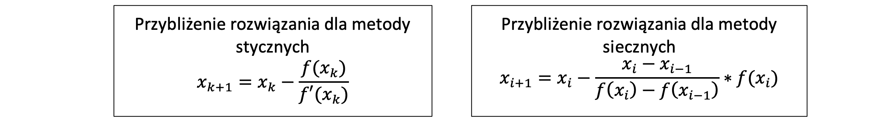

## Opis programu

Program wyznacza rozwiązanie równania metodą stycznych i siecznych. W metodzie stycznych użytkownik podaje punkt startowy. Następnie wyznacza punkt przecięcia stycznej z osią OX (przybliżenie rozwiązania) i funkcję w tym punkcie porównuje z dokładnością podaną przez użytkownika. Obliczenia kończą się jak otrzymany wynik jest mniejszy od danej dokładności. W metodzie siecznych użytkownik podaje dwa punkty startowe. Program oblicza przybliżenie rozwiązania. Porównuje funkcję z dokładnością podaną przez użytkownika w tym punkcie i przy spełnionym warunku wypisuje wynik obliczeń.

#### Przybliżenie rozwiązania dla metody stycznych wymaga pochodnej funkcji.

## Działanie programu

Działanie programu zostało przedstawione za pomocą przykładowej funkcji wielomianowej i jej pochodnej

### Dane wprowadzone przez użytkownika

### Graficzne przedstawienie działania programu

## Wyniki obliczeń

